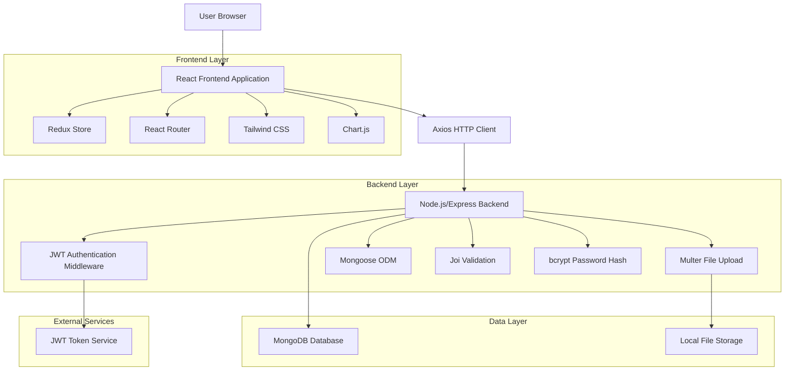
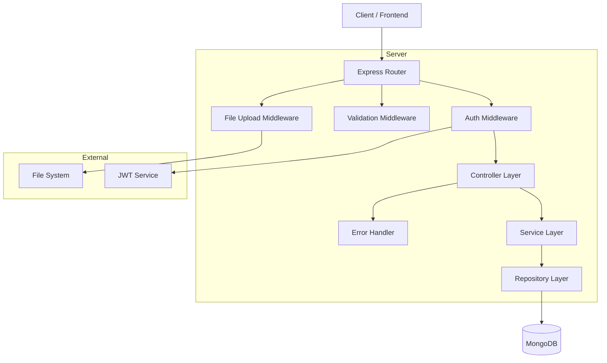
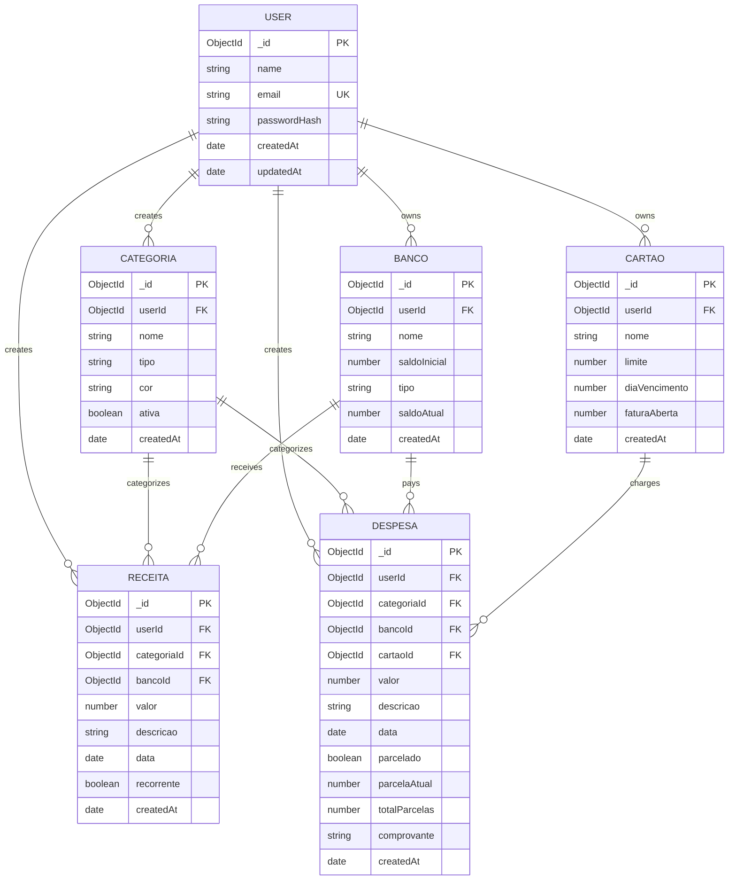

# Documento de Arquitetura Técnica - Sistema de Finanças Pessoais

## 1. Architecture design



## 2. Technology Description

* Frontend: React\@18 + Redux Toolkit + React Router\@6 + Tailwind CSS\@3 + Chart.js\@4 + Axios + Yup + Vite

* Backend: Node.js\@18 + Express\@4 + Mongoose\@7 + JWT + bcrypt + Multer + Joi + cors + dotenv

## 3. Route definitions

| Route       | Purpose                                                    |
| ----------- | ---------------------------------------------------------- |
| /           | Dashboard principal, exibe métricas e gráficos financeiros |
| /login      | Página de autenticação de usuário                          |
| /register   | Página de cadastro de novo usuário                         |
| /receitas   | Listagem e gerenciamento de receitas                       |
| /despesas   | Listagem e gerenciamento de despesas                       |
| /categorias | Gerenciamento de categorias de receitas e despesas         |
| /bancos     | Controle de contas bancárias e saldos                      |
| /cartoes    | Gerenciamento de cartões de crédito e faturas              |
| /perfil     | Configurações do usuário e dados pessoais                  |

## 4. API definitions

### 4.1 Core API

**Autenticação de usuários**

```
POST /api/auth/register
```

Request:

| Param Name | Param Type | isRequired | Description                   |
| ---------- | ---------- | ---------- | ----------------------------- |
| name       | string     | true       | Nome completo do usuário      |
| email      | string     | true       | Email válido para login       |
| password   | string     | true       | Senha com mínimo 6 caracteres |

Response:

| Param Name | Param Type | Description                 |
| ---------- | ---------- | --------------------------- |
| success    | boolean    | Status da operação          |
| token      | string     | JWT token para autenticação |
| user       | object     | Dados básicos do usuário    |

```
POST /api/auth/login
```

Request:

| Param Name | Param Type | isRequired | Description      |
| ---------- | ---------- | ---------- | ---------------- |
| email      | string     | true       | Email do usuário |
| password   | string     | true       | Senha do usuário |

Response:

| Param Name | Param Type | Description                 |
| ---------- | ---------- | --------------------------- |
| success    | boolean    | Status da operação          |
| token      | string     | JWT token para autenticação |
| user       | object     | Dados do usuário logado     |

**Gerenciamento de Receitas**

```
GET /api/receitas
```

Query Parameters:

| Param Name | Param Type | isRequired | Description                    |
| ---------- | ---------- | ---------- | ------------------------------ |
| page       | number     | false      | Número da página (default: 1)  |
| limit      | number     | false      | Itens por página (default: 10) |
| categoria  | string     | false      | ID da categoria para filtro    |
| dataInicio | string     | false      | Data inicial (YYYY-MM-DD)      |
| dataFim    | string     | false      | Data final (YYYY-MM-DD)        |

```
POST /api/receitas
```

Request:

| Param Name | Param Type | isRequired | Description                  |
| ---------- | ---------- | ---------- | ---------------------------- |
| valor      | number     | true       | Valor da receita             |
| descricao  | string     | true       | Descrição da receita         |
| categoria  | string     | true       | ID da categoria              |
| data       | string     | true       | Data da receita (YYYY-MM-DD) |
| recorrente | boolean    | false      | Se é receita recorrente      |
| bancoId    | string     | false      | ID da conta bancária         |

**Gerenciamento de Despesas**

```
GET /api/despesas
```

```
POST /api/despesas
```

Request:

| Param Name    | Param Type | isRequired | Description                  |
| ------------- | ---------- | ---------- | ---------------------------- |
| valor         | number     | true       | Valor da despesa             |
| descricao     | string     | true       | Descrição da despesa         |
| categoria     | string     | true       | ID da categoria              |
| data          | string     | true       | Data da despesa              |
| parcelado     | boolean    | false      | Se é parcelado               |
| parcelaAtual  | number     | false      | Parcela atual (se parcelado) |
| totalParcelas | number     | false      | Total de parcelas            |
| cartaoId      | string     | false      | ID do cartão (se aplicável)  |
| bancoId       | string     | false      | ID da conta bancária         |

```
POST /api/despesas/upload
```

Request (multipart/form-data):

| Param Name | Param Type | isRequired | Description                     |
| ---------- | ---------- | ---------- | ------------------------------- |
| file       | file       | true       | Arquivo de comprovante (imagem) |
| despesaId  | string     | true       | ID da despesa                   |

**Gerenciamento de Categorias**

```
GET /api/categorias
POST /api/categorias
PUT /api/categorias/:id
DELETE /api/categorias/:id
```

**Gerenciamento de Bancos**

```
GET /api/bancos
POST /api/bancos
PUT /api/bancos/:id
DELETE /api/bancos/:id
```

**Gerenciamento de Cartões**

```
GET /api/cartoes
POST /api/cartoes
PUT /api/cartoes/:id
DELETE /api/cartoes/:id
POST /api/cartoes/:id/pagar-fatura
```

**Dashboard e Relatórios**

```
GET /api/dashboard/metricas
```

Response:

| Param Name          | Param Type | Description                    |
| ------------------- | ---------- | ------------------------------ |
| saldoTotal          | number     | Saldo total de todas as contas |
| receitasMes         | number     | Total de receitas do mês atual |
| despesasMes         | number     | Total de despesas do mês atual |
| parcelasPendentes   | number     | Número de parcelas pendentes   |
| proximosVencimentos | array      | Lista de próximos vencimentos  |

```
GET /api/dashboard/graficos
```

Response:

| Param Name         | Param Type | Description                  |
| ------------------ | ---------- | ---------------------------- |
| categoriasDespesas | array      | Dados para gráfico de pizza  |
| evolucaoMensal     | array      | Dados para gráfico de linha  |
| receitasVsDespesas | array      | Dados para gráfico de barras |

## 5. Server architecture diagram



## 6. Data model

### 6.1 Data model definition



### 6.2 Data Definition Language

**Tabela de Usuários (users)**

```javascript
// Schema Mongoose
const userSchema = new mongoose.Schema({
  name: {
    type: String,
    required: true,
    trim: true
  },
  email: {
    type: String,
    required: true,
    unique: true,
    lowercase: true
  },
  passwordHash: {
    type: String,
    required: true
  }
}, {
  timestamps: true
});

// Índices
userSchema.index({ email: 1 });
```

**Tabela de Categorias (categorias)**

```javascript
const categoriaSchema = new mongoose.Schema({
  userId: {
    type: mongoose.Schema.Types.ObjectId,
    ref: 'User',
    required: true
  },
  nome: {
    type: String,
    required: true,
    trim: true
  },
  tipo: {
    type: String,
    enum: ['receita', 'despesa'],
    required: true
  },
  cor: {
    type: String,
    required: true,
    match: /^#[0-9A-F]{6}$/i
  },
  ativa: {
    type: Boolean,
    default: true
  }
}, {
  timestamps: true
});

// Índices
categoriaSchema.index({ userId: 1, tipo: 1 });
categoriaSchema.index({ userId: 1, ativa: 1 });
```

**Tabela de Receitas (receitas)**

```javascript
const receitaSchema = new mongoose.Schema({
  userId: {
    type: mongoose.Schema.Types.ObjectId,
    ref: 'User',
    required: true
  },
  categoriaId: {
    type: mongoose.Schema.Types.ObjectId,
    ref: 'Categoria',
    required: true
  },
  bancoId: {
    type: mongoose.Schema.Types.ObjectId,
    ref: 'Banco'
  },
  valor: {
    type: Number,
    required: true,
    min: 0
  },
  descricao: {
    type: String,
    required: true,
    trim: true
  },
  data: {
    type: Date,
    required: true
  },
  recorrente: {
    type: Boolean,
    default: false
  }
}, {
  timestamps: true
});

// Índices
receitaSchema.index({ userId: 1, data: -1 });
receitaSchema.index({ userId: 1, categoriaId: 1 });
```

**Tabela de Despesas (despesas)**

```javascript
const despesaSchema = new mongoose.Schema({
  userId: {
    type: mongoose.Schema.Types.ObjectId,
    ref: 'User',
    required: true
  },
  categoriaId: {
    type: mongoose.Schema.Types.ObjectId,
    ref: 'Categoria',
    required: true
  },
  bancoId: {
    type: mongoose.Schema.Types.ObjectId,
    ref: 'Banco'
  },
  cartaoId: {
    type: mongoose.Schema.Types.ObjectId,
    ref: 'Cartao'
  },
  valor: {
    type: Number,
    required: true,
    min: 0
  },
  descricao: {
    type: String,
    required: true,
    trim: true
  },
  data: {
    type: Date,
    required: true
  },
  parcelado: {
    type: Boolean,
    default: false
  },
  parcelaAtual: {
    type: Number,
    min: 1
  },
  totalParcelas: {
    type: Number,
    min: 1
  },
  comprovante: {
    type: String
  }
}, {
  timestamps: true
});

// Índices
despesaSchema.index({ userId: 1, data: -1 });
despesaSchema.index({ userId: 1, cartaoId: 1 });
despesaSchema.index({ userId: 1, categoriaId: 1 });
```

**Tabela de Bancos (bancos)**

```javascript
const bancoSchema = new mongoose.Schema({
  userId: {
    type: mongoose.Schema.Types.ObjectId,
    ref: 'User',
    required: true
  },
  nome: {
    type: String,
    required: true,
    trim: true
  },
  saldoInicial: {
    type: Number,
    required: true,
    default: 0
  },
  tipo: {
    type: String,
    enum: ['corrente', 'poupanca'],
    required: true
  },
  saldoAtual: {
    type: Number,
    default: function() { return this.saldoInicial; }
  }
}, {
  timestamps: true
});

// Índices
bancoSchema.index({ userId: 1 });
```

**Tabela de Cartões (cartoes)**

```javascript
const cartaoSchema = new mongoose.Schema({
  userId: {
    type: mongoose.Schema.Types.ObjectId,
    ref: 'User',
    required: true
  },
  nome: {
    type: String,
    required: true,
    trim: true
  },
  limite: {
    type: Number,
    required: true,
    min: 0
  },
  diaVencimento: {
    type: Number,
    required: true,
    min: 1,
    max: 31
  },
  faturaAberta: {
    type: Number,
    default: 0,
    min: 0
  }
}, {
  timestamps: true
});

// Índices
cartaoSchema.index({ userId: 1 });
cartaoSchema.index({ userId: 1, diaVencimento: 1 });
```

**Dados Iniciais (Seeders)**

```javascript
// Categorias padrão para novos usuários
const categoriasDefault = [
  { nome: 'Salário', tipo: 'receita', cor: '#10B981' },
  { nome: 'Freelance', tipo: 'receita', cor: '#3B82F6' },
  { nome: 'Investimentos', tipo: 'receita', cor: '#8B5CF6' },
  { nome: 'Alimentação', tipo: 'despesa', cor: '#EF4444' },
  { nome: 'Transporte', tipo: 'despesa', cor: '#F59E0B' },
  { nome: 'Moradia', tipo: 'despesa', cor: '#6B7280' },
  { nome: 'Saúde', tipo: 'despesa', cor: '#EC4899' },
  { nome: 'Educação', tipo: 'despesa', cor: '#14B8A6' },
  { nome: 'Lazer', tipo: 'despesa', cor: '#F97316' }
];
```

