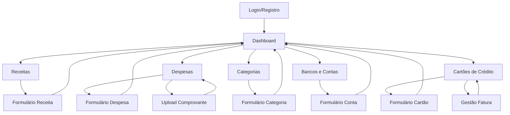

# Documento de Requisitos de Produto - Sistema de Finanças Pessoais

## 1. Product Overview

Sistema completo de gerenciamento pessoal de finanças que permite aos usuários controlar receitas, despesas, cartões de crédito e contas bancárias de forma integrada e intuitiva.

O produto resolve a necessidade de organização financeira pessoal, oferecendo dashboards visuais, controle de parcelas, alertas de vencimento e análises detalhadas para tomada de decisões financeiras mais assertivas.

Direcionado para pessoas físicas que buscam maior controle e visibilidade sobre suas finanças pessoais, com potencial de expansão para pequenos negócios familiares.

## 2. Core Features

### 2.1 User Roles

| Role | Registration Method | Core Permissions |
|------|---------------------|------------------|
| Usuário Registrado | Email e senha | Acesso completo a todas funcionalidades do sistema, gerenciamento de dados pessoais |

### 2.2 Feature Module

Nosso sistema de finanças pessoais consiste nas seguintes páginas principais:

1. **Dashboard**: visão geral financeira, gráficos de análise, métricas principais, alertas de vencimento.
2. **Receitas**: listagem de receitas, formulários de cadastro/edição, filtros por período e categoria.
3. **Despesas**: controle de gastos, upload de comprovantes, gestão de parcelas, associação com cartões.
4. **Categorias**: criação e edição de categorias personalizadas, definição de cores para gráficos.
5. **Bancos e Contas**: gerenciamento de contas bancárias, controle de saldos, histórico de transações.
6. **Cartões de Crédito**: controle de limites, faturas, parcelas pendentes, alertas de vencimento.
7. **Login/Registro**: autenticação de usuários, recuperação de senha.

### 2.3 Page Details

| Page Name | Module Name | Feature description |
|-----------|-------------|---------------------|
| Dashboard | Métricas Principais | Exibir saldo total, receitas do mês, despesas do mês, parcelas pendentes em cards visuais |
| Dashboard | Gráficos Analíticos | Mostrar gráfico de pizza para categorias de despesas, linha temporal de evolução mensal, barras comparativas receitas vs despesas |
| Dashboard | Alertas e Notificações | Alertar sobre vencimentos de cartões, parcelas próximas, limites de cartão próximos do máximo |
| Dashboard | Filtros de Período | Filtrar dados por mês/ano, categoria específica, cartão ou banco |
| Receitas | Lista de Receitas | Listar receitas com paginação, ordenação por data/valor, filtros por categoria e período |
| Receitas | Formulário de Receita | Cadastrar/editar receitas com campos: valor, descrição, categoria, data, recorrência |
| Receitas | Gestão de Recorrência | Configurar receitas recorrentes mensais, gerar automaticamente próximas ocorrências |
| Despesas | Lista de Despesas | Exibir despesas com filtros avançados, busca por descrição, ordenação múltipla |
| Despesas | Formulário de Despesa | Criar/editar despesas com upload de comprovante, associação com cartão, configuração de parcelas |
| Despesas | Sistema de Parcelas | Dividir despesas em parcelas, associar ao cartão, calcular impacto na fatura mensal |
| Despesas | Upload de Comprovantes | Fazer upload de imagens de comprovantes, visualizar anexos, gerenciar arquivos |
| Categorias | Lista de Categorias | Mostrar categorias por tipo (receita/despesa), editar cores, gerenciar categorias ativas |
| Categorias | Formulário de Categoria | Criar categorias personalizadas com nome, tipo, cor para gráficos |
| Bancos e Contas | Lista de Contas | Exibir contas bancárias com saldos atualizados, tipos de conta, histórico resumido |
| Bancos e Contas | Formulário de Conta | Cadastrar contas com saldo inicial, tipo (corrente/poupança), configurações |
| Bancos e Contas | Controle de Saldo | Atualizar saldo automaticamente com receitas/despesas, exibir extrato simplificado |
| Cartões de Crédito | Lista de Cartões | Mostrar cartões com limite disponível, fatura atual, próximo vencimento |
| Cartões de Crédito | Formulário de Cartão | Cadastrar cartões com limite, dia de vencimento, configurações de alerta |
| Cartões de Crédito | Gestão de Fatura | Calcular fatura mensal, mostrar parcelas do período, registrar pagamentos |
| Cartões de Crédito | Controle de Parcelas | Listar parcelas pendentes, calendário de vencimentos, alertas automáticos |
| Login/Registro | Autenticação | Fazer login com email/senha, manter sessão com JWT, logout seguro |
| Login/Registro | Cadastro de Usuário | Registrar novo usuário com validações, confirmação de email, políticas de senha |

## 3. Core Process

**Fluxo Principal do Usuário:**

O usuário acessa o sistema através da página de login, onde pode se autenticar ou criar uma nova conta. Após o login, é direcionado ao Dashboard que apresenta uma visão geral de sua situação financeira atual.

No Dashboard, o usuário visualiza métricas importantes como saldo total, receitas e despesas do mês, além de gráficos que mostram a distribuição de gastos por categoria e evolução temporal. Alertas automáticos informam sobre vencimentos próximos de cartões e parcelas pendentes.

Para gerenciar receitas, o usuário navega para a página específica onde pode adicionar novas entradas, configurar recorrências mensais e filtrar por períodos. O mesmo processo se aplica às despesas, com a funcionalidade adicional de upload de comprovantes e associação com cartões de crédito.

O controle de cartões permite ao usuário cadastrar seus cartões, definir limites e acompanhar faturas. Ao adicionar despesas parceladas, o sistema automaticamente distribui os valores pelas próximas faturas e gera alertas de vencimento.

**Fluxo de Navegação:**

## 4. User Interface Design

### 4.1 Design Style

- **Cores Primárias**: Verde (#10B981) para receitas e ações positivas, Vermelho (#EF4444) para despesas e alertas
- **Cores Secundárias**: Azul (#3B82F6) para informações neutras, Cinza (#6B7280) para textos secundários
- **Estilo de Botões**: Botões arredondados com sombras suaves, estados hover com transições suaves
- **Tipografia**: Inter como fonte principal, tamanhos 14px para texto base, 16px para labels, 24px+ para títulos
- **Layout**: Design baseado em cards com espaçamento generoso, sidebar responsiva, grid system flexível
- **Ícones**: Heroicons para consistência, ícones de linha para ações secundárias, preenchidos para ações primárias

### 4.2 Page Design Overview

| Page Name | Module Name | UI Elements |
|-----------|-------------|-------------|
| Dashboard | Cards de Métricas | Cards com fundo branco, bordas sutis, ícones coloridos, valores em destaque com tipografia bold |
| Dashboard | Gráficos | Gráficos Chart.js com paleta de cores consistente, tooltips informativos, legendas claras |
| Dashboard | Sidebar | Navegação lateral com ícones, estados ativos destacados, collapse responsivo para mobile |
| Receitas/Despesas | Tabelas | Tabelas responsivas com zebra striping, ações inline, filtros no cabeçalho |
| Receitas/Despesas | Formulários Modais | Modais centralizados com backdrop, campos organizados em grid, validações visuais |
| Cartões | Cards de Cartão | Cards estilizados simulando cartões reais, gradientes sutis, informações hierarquizadas |
| Bancos | Lista de Contas | Layout de lista com avatars de bancos, saldos destacados, indicadores de status |

### 4.3 Responsiveness

O sistema é desenvolvido com abordagem mobile-first, garantindo experiência otimizada em dispositivos móveis. A sidebar colapsa em menu hambúrguer em telas menores, tabelas se transformam em cards empilhados, e formulários se adaptam para toque com campos maiores e espaçamento adequado.

Breakpoints principais: 640px (sm), 768px (md), 1024px (lg), 1280px (xl) seguindo padrões do Tailwind CSS.